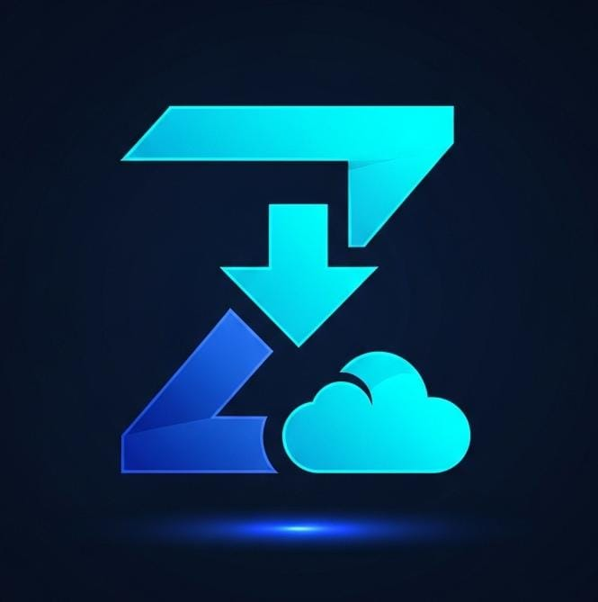

<p align="center">
  
</p>

# ZEDD - (Zekk External Downloader Drive)

Bosen download video terus harus upload manual ke Drive? <br> **ZEDD** hadir buat nyelesein masalah itu. Tool ini ngebantu kamu buat narik file dari internet (YouTube, TikTok, Instagram, dll) dan langsung lempar ke Google Drive kamu tanpa perlu mampir dulu ke storage lokal yang penuh.

---

## Kenapa pake ZEDD?
- **Gak Makan Kuota Lokal**: File langsung dikirim ke Cloud (via server backend).
- **Support 1000+ Situs**: Pake tenaga `yt-dlp`, apa aja bisa ditarik.
- **Tampilan Premium**: UI cakep pake efek *glassmorphism* yang manjain mata.
- **Otomatis & Cepat**: Tinggal paste link, klik, dan tunggu notif selesai.

---

## Persiapan Awal
### Prasyarat
| Tool | Kebutuhan |
|------|-----------|
| Python | 3.10+ |
| yt-dlp | Terinstall otomatis lewat `start.bat` |
| FFmpeg | **Otomatis diunduh saat pertama kali menjalankan `start.bat`** |
| Google Cloud Project | OAuth 2.0 Client ID (Web App) |

---

## Cara Pakai (Gampang Banget!)

### 1. Setting Kunci (API)
Aplikasi ini butuh "kunci" (Client ID & Secret) dari Google Cloud. Tapi tenang, kunci asli kamu jangan pernah di-share! 
1. Di folder `backend/`, kamu bakal nemu file **`.env.example`**.
2. Salin (copy) file itu dan ubah namanya jadi **`.env`**.
3. Buka file `.env` baru itu, terus isi bagian ini pake kunci yang kamu dapet dari Google:
```ini
GOOGLE_CLIENT_ID=isi_disini
GOOGLE_CLIENT_SECRET=isi_disini
REDIRECT_URI=http://localhost:8000/auth/callback
LOCAL_MODE=false
```
> [!IMPORTANT]
> Jangan pernah upload file `.env` asli kamu ke GitHub karena berisi rahasia pribadi! Yang di-upload cukup `.env.example` sebagai panduan buat orang lain.

### 2. Nyalain Mesin
Gak perlu ribet ngetik perintah panjang di terminal. Cukup klik 2x file:
👉 **`start.bat`**
*(Tunggu bentar sampe muncul tulisan 'Backend Ready')*

### 3. Mulai Download!
Buka file `frontend/index.html` di browser (pake VSCode Live Server lebih mantap). 
- Login dulu pake akun Google kamu.
- Paste link video/file yang mau diunduh.
- Klik tombol download dan pantau progress bar-nya sampe 100%.
- **Cek Google Drive kamu!** File bakal muncul di folder `ZEDD_DOWNLOADS`.

---

## 📂 Struktur Folder
Kalo mau ngoprek kodenya, ini petanya:
- **`backend/`**: Otak dari aplikasi (pake FastAPI & Python).
  - `app/`: Logika utama (Service, Routes, Config).
  - `run.py`: Script buat nyalain server.
- **`frontend/`**: Tampilan antarmuka yang kamu liat di browser.
- **`start.bat`**: Shortcut buat kamu yang males buka terminal.

---

## ⚠️ Catatan
- File `.env` jangan pernah dikasih tau ke siapa-siapa atau di-share ke publik!
- Kalo mau simpan ke komputer aja tanpa Google Drive, ubah `LOCAL_MODE=true` di file `.env`.

---

*Customized with ❤ by **Zekk Store***
